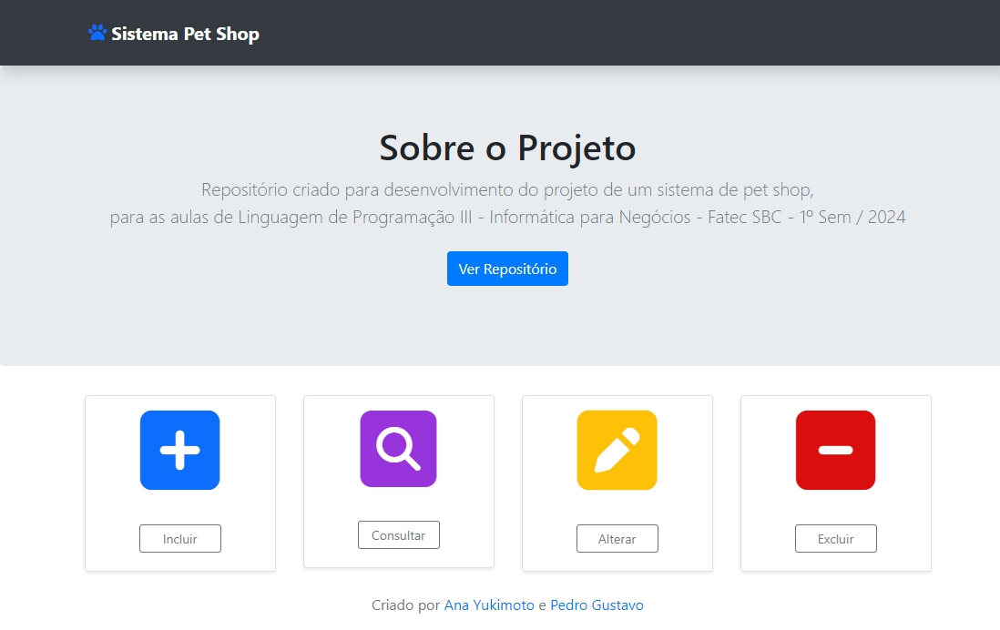
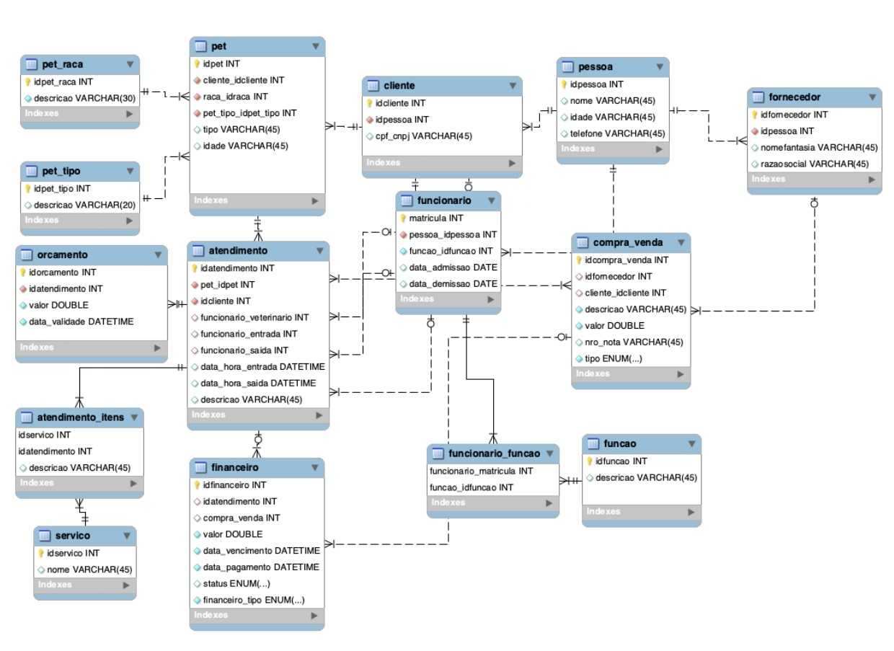

# Sistema Pet Shop
Repositório criado para desenvolvimento do projeto de um sistema de pet shop, para as aulas de Linguagem de Programação III - Informática para Negócios - Fatec SBC - 1º Sem / 2024

## Tecnologias Utilizadas
      

## Modelo Entidade-Relacionamento (MER) do Sistema

